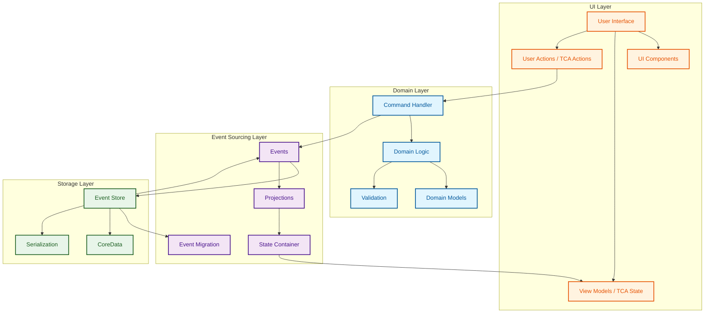
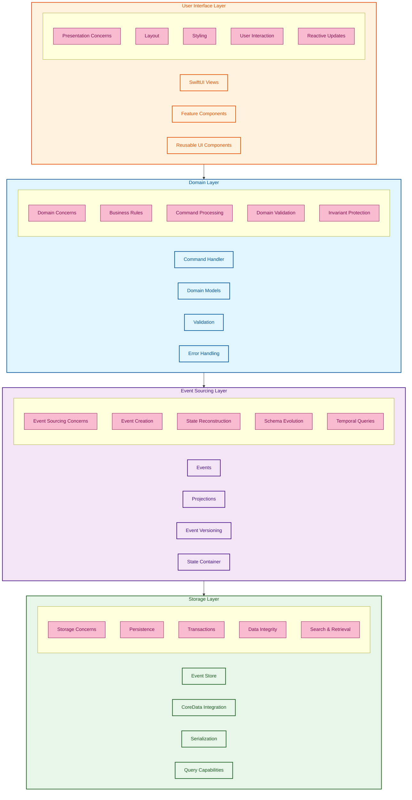
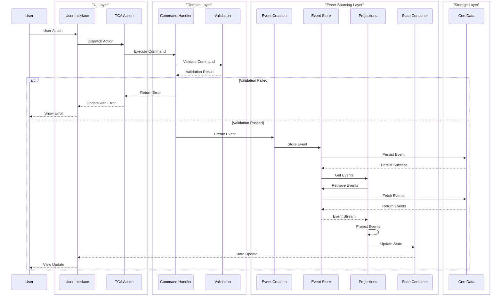
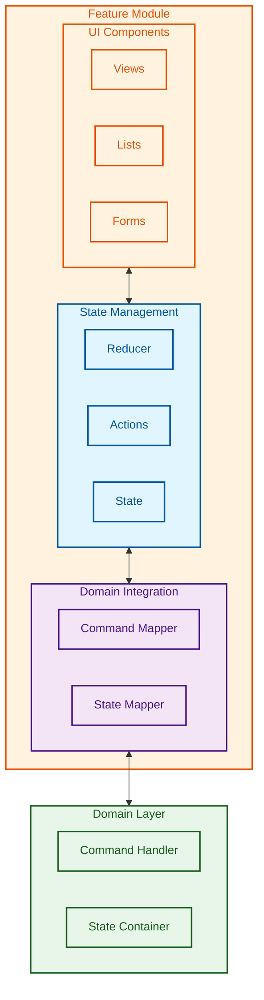

# Application Layered Architecture

This document illustrates the layered architecture of the MonoSphere application, showing how the different layers interact and their responsibilities.

## Clean Architecture Layers

## Layered Architecture with Concerns

## Data Flow Through Layers

## Clean Architecture Onion Model

```mermaid
graph TD
    subgraph Onion["Clean Architecture"]
        subgraph CoreLayer["Core Domain"]
            DM["Domain Models"]
            BR["Business Rules"]
        end
        
        subgraph DomainLayer["Domain Layer"]
            ES["Event Sourcing"]
            CH["Command Handling"]
            V["Validation"]
        end
        
        subgraph ApplicationLayer["Application Layer"]
            S["Services"]
            P["Projections"]
            I["Interfaces"]
        end
        
        subgraph InfrastructureLayer["Infrastructure Layer"]
            ESt["Event Store"]
            CD["CoreData"]
            C["Cache"]
        end
        
        subgraph PresentationLayer["Presentation Layer"]
            UI["User Interface"]
            TCA["TCA Components"]
            VM["View Models"]
        end
    end
    
    PresentationLayer --> ApplicationLayer
    ApplicationLayer --> DomainLayer
    DomainLayer --> CoreLayer
    InfrastructureLayer --> ApplicationLayer
    
    classDef coreNode fill:#f3e5f5,stroke:#4a148c,stroke-width:2px,color:#4a148c;
    classDef domainNode fill:#e1f5fe,stroke:#01579b,stroke-width:2px,color:#01579b;
    classDef applicationNode fill:#e8f5e9,stroke:#1b5e20,stroke-width:2px,color:#1b5e20;
    classDef infraNode fill:#fff9c4,stroke:#f57f17,stroke-width:2px,color:#f57f17;
    classDef presentationNode fill:#fff3e0,stroke:#e65100,stroke-width:2px,color:#e65100;
    
    class CoreLayer,DM,BR coreNode;
    class DomainLayer,ES,CH,V domainNode;
    class ApplicationLayer,S,P,I applicationNode;
    class InfrastructureLayer,ESt,CD,C infraNode;
    class PresentationLayer,UI,TCA,VM presentationNode;
```

## Feature Module Architecture

## Key Architecture Principles

The layered architecture of MonoSphere is guided by these key principles:

1. **Separation of Concerns** - Each layer has a specific, focused responsibility
2. **Dependency Rule** - Dependencies flow inward, with the domain layer at the center
3. **Domain-Driven Design** - Business rules and domain logic are in the domain layer
4. **Event Sourcing** - All state changes are captured as events
5. **Testability** - Each layer can be tested in isolation with mocked dependencies
6. **Functional Core, Imperative Shell** - Core domain logic is functional and pure, with side effects at the edges
7. **Unidirectional Data Flow** - Data flows in one direction, with state updates triggering UI changes