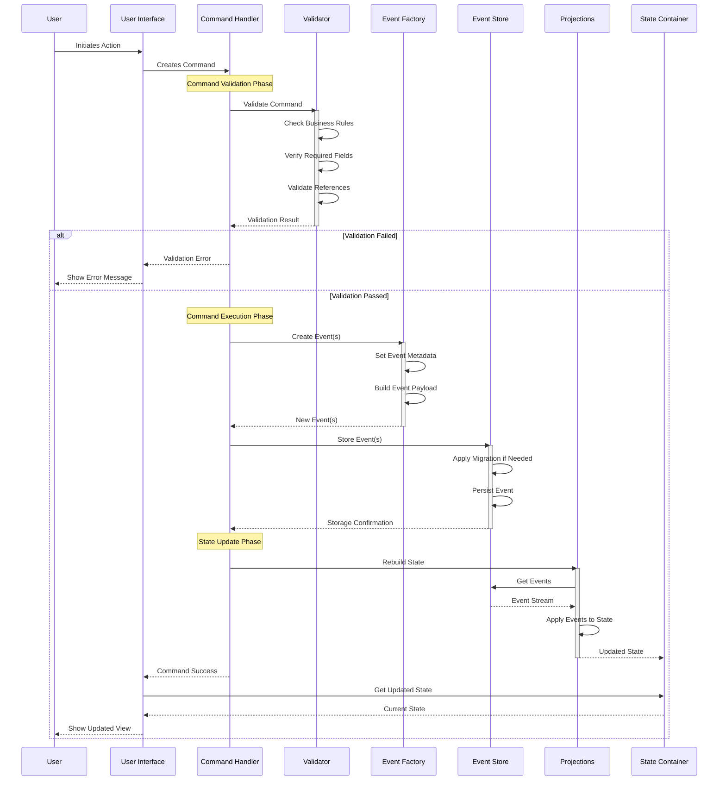
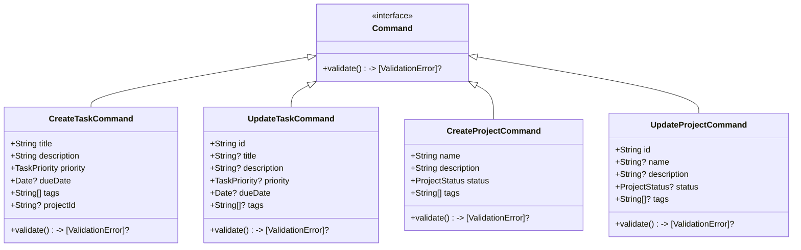
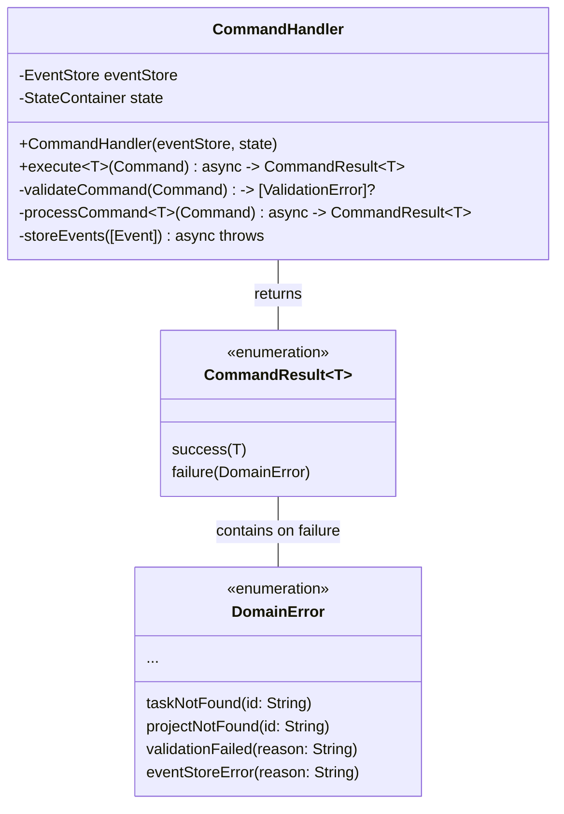
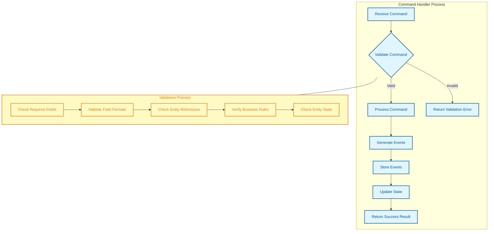
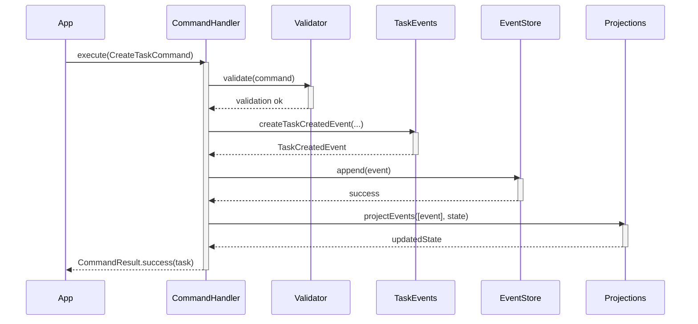

# Command Processing Flow

This document illustrates the command processing flow in the MonoSphere application, showing how user actions are transformed into commands, validated, and then converted into events that update the application state.

## Basic Command Flow

```mermaid
graph LR
    A[User Action] --> B[Command Creation]
    B --> C[Validation]
    C --> D[Processing]
    D --> E[Event Storage]
    E --> F[Projection]
    F --> G[State Update]
    G --> H[UI Update]
    
    classDef userNode fill:#fff3e0,stroke:#e65100,stroke-width:2px,color:#e65100;
    classDef commandNode fill:#e1f5fe,stroke:#01579b,stroke-width:2px,color:#01579b;
    classDef eventNode fill:#f3e5f5,stroke:#4a148c,stroke-width:2px,color:#4a148c;
    classDef stateNode fill:#e8f5e9,stroke:#1b5e20,stroke-width:2px,color:#1b5e20;
    
    class A,H userNode;
    class B,C,D commandNode;
    class E,F eventNode;
    class G stateNode;
```

## Detailed Command Processing Sequence

## Command Structure

## Command Handler Implementation

## Validation Process

## Example Command Flow: Create Task

## Command Benefits in MonoSphere

The command processing flow in MonoSphere provides several benefits:

1. **Validation** - Commands are validated before execution to ensure data integrity
2. **Single Responsibility** - Each command handles one specific action
3. **Auditing** - Commands generate events that form an audit trail
4. **Testability** - Command handling logic can be tested in isolation
5. **Error Handling** - Structured error types for different failure scenarios
6. **Immutability** - Commands and events are immutable, preventing side effects