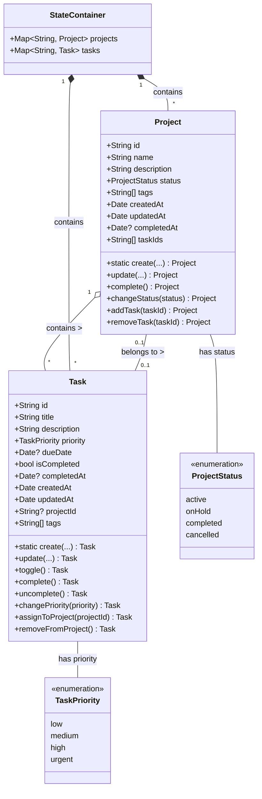
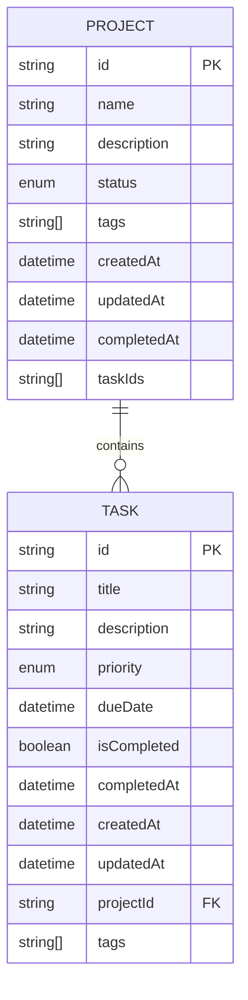
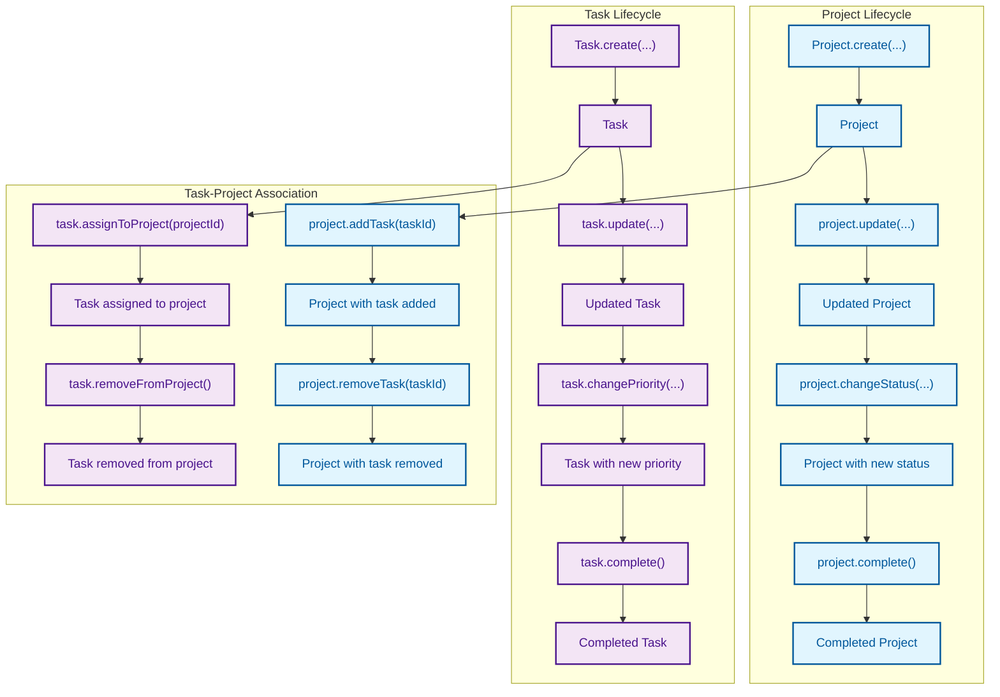
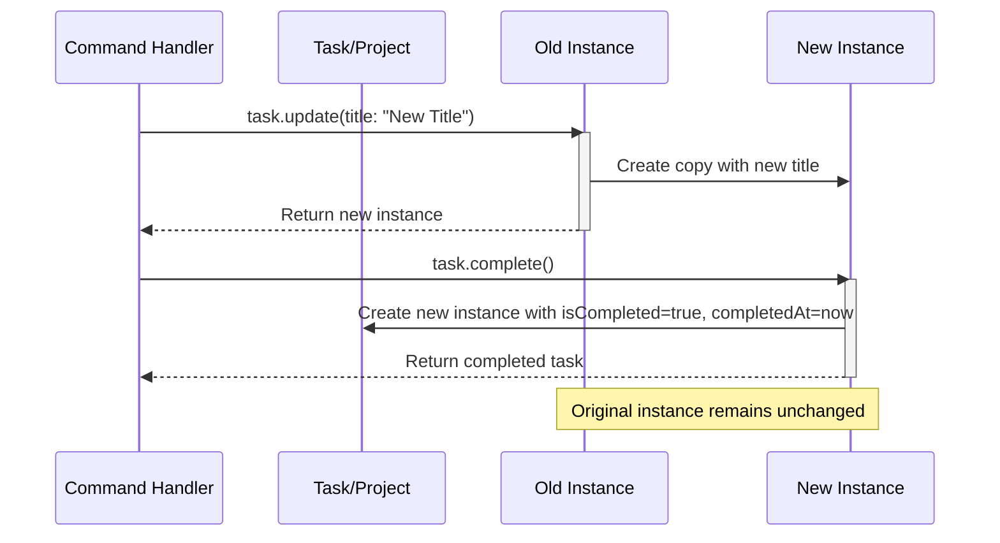
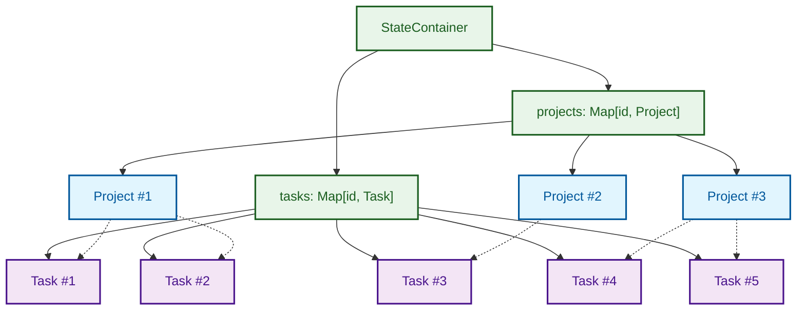

# Domain Model Relationships

This document illustrates the relationships between the core domain models in the MonoSphere application, showing their structure, relationships, and key behaviors.

## Core Domain Models

## Domain Model Entity Relationships

## Model Creation and Mutation Flows

## Immutable Model Updates

## State Container Composition

## Domain Event Types

```mermaid
graph TD
    E[Event] --> TE[Task Events]
    E --> PE[Project Events]
    
    TE --> TC[TaskCreated]
    TE --> TU[TaskUpdated]
    TE --> TD[TaskDeleted]
    TE --> TCP[TaskCompleted]
    TE --> TUC[TaskUncompleted]
    TE --> TPR[TaskPriorityChanged]
    TE --> TAP[TaskAssignedToProject]
    TE --> TRP[TaskRemovedFromProject]
    
    PE --> PC[ProjectCreated]
    PE --> PU[ProjectUpdated]
    PE --> PD[ProjectDeleted]
    PE --> PCP[ProjectCompleted]
    PE --> PSC[ProjectStatusChanged]
    PE --> PTA[ProjectTaskAdded]
    PE --> PTR[ProjectTaskRemoved]
    
    classDef eventNode fill:#f3e5f5,stroke:#4a148c,stroke-width:2px,color:#4a148c;
    classDef taskEventNode fill:#e1f5fe,stroke:#01579b,stroke-width:2px,color:#01579b;
    classDef projectEventNode fill:#e8f5e9,stroke:#1b5e20,stroke-width:2px,color:#1b5e20;
    
    class E,TE,PE eventNode;
    class TC,TU,TD,TCP,TUC,TPR,TAP,TRP taskEventNode;
    class PC,PU,PD,PCP,PSC,PTA,PTR projectEventNode;
```

## Domain Model Design Principles

MonoSphere's domain models follow these key design principles:

1. **Immutability** - All models are immutable value types
2. **Functional Updates** - Models are updated through pure functions that return new instances
3. **Identity** - Each model has a unique identifier
4. **Rich Domain Model** - Models encapsulate behavior, not just data
5. **Consistent Time Tracking** - All models track creation, update, and completion times
6. **Explicit Relationships** - Relationships between models are explicit and managed
7. **Type Safety** - Enums are used for constrained values like status and priority