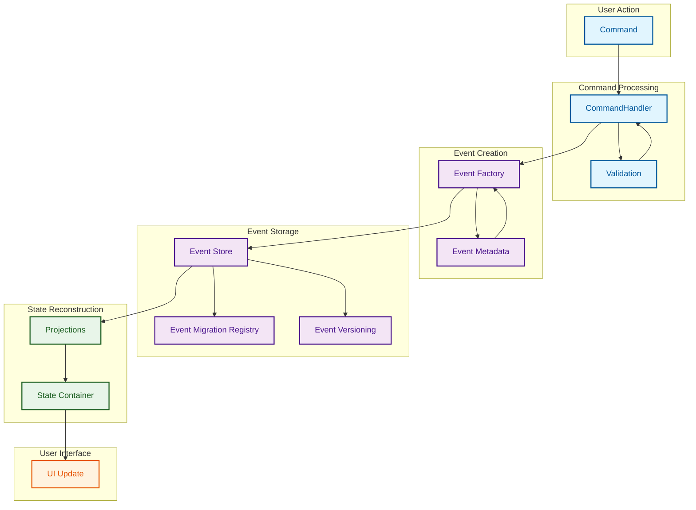
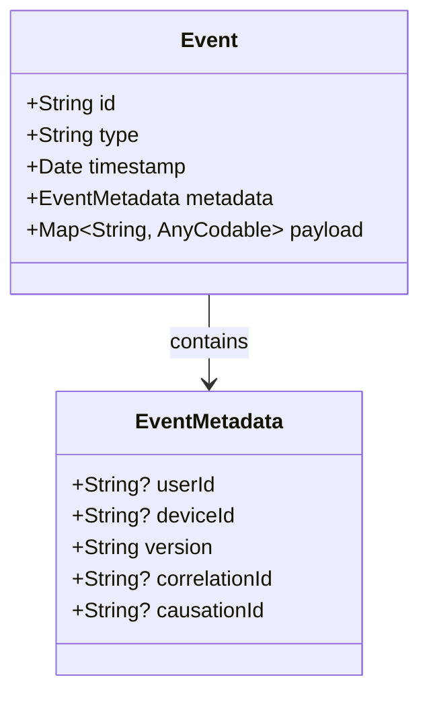
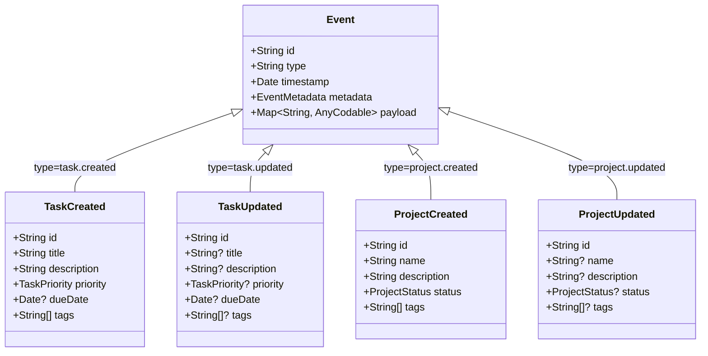
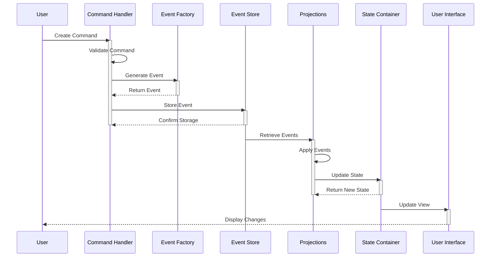

# Event Sourcing Architecture

This diagram illustrates the Event Sourcing architecture used in the MonoSphere application. Event Sourcing is a pattern that captures all changes to an application state as a sequence of events.

## Core Event Sourcing Flow

## Event Structure

## Event Types

## Event Flow Through System

## Key Benefits of Event Sourcing in MonoSphere

1. **Complete Audit Trail** - Every change in the system is recorded as an event
2. **Temporal Queries** - State can be reconstructed for any point in time
3. **Immutability** - Events are immutable, simplifying concurrency management
4. **Business Focus** - Events represent meaningful business changes
5. **Extensibility** - New projections can be added without changing the event store
6. **Debuggability** - System behavior can be reproduced by replaying events