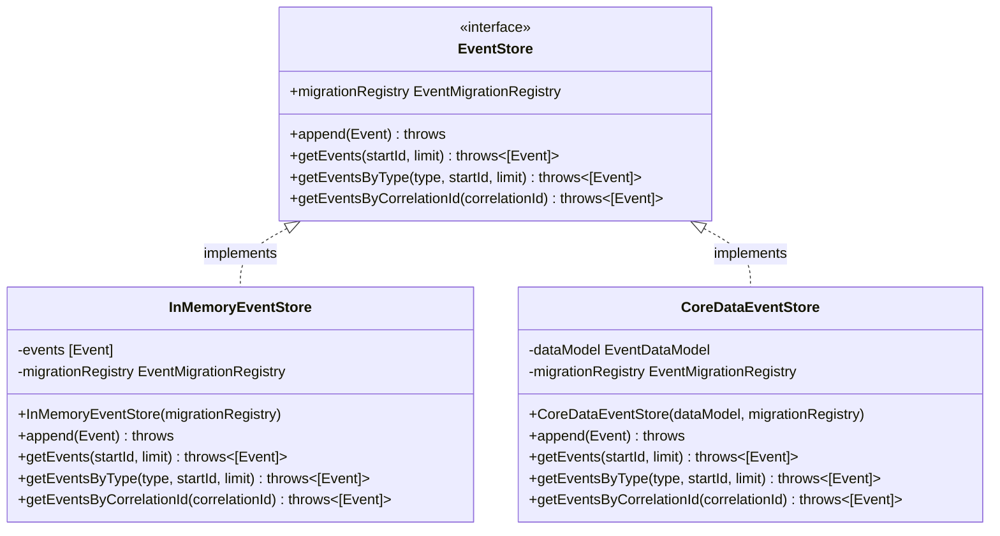
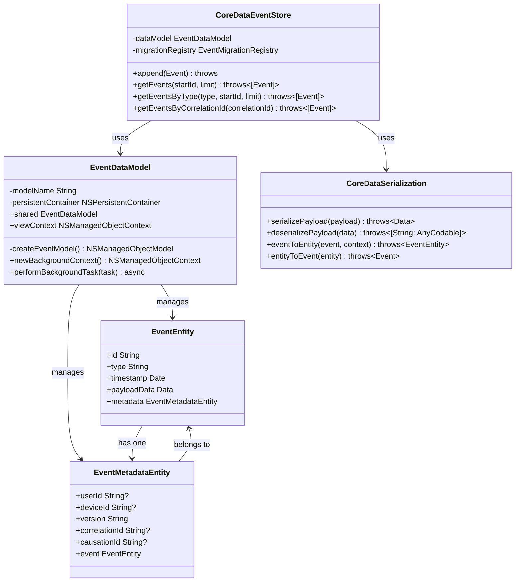
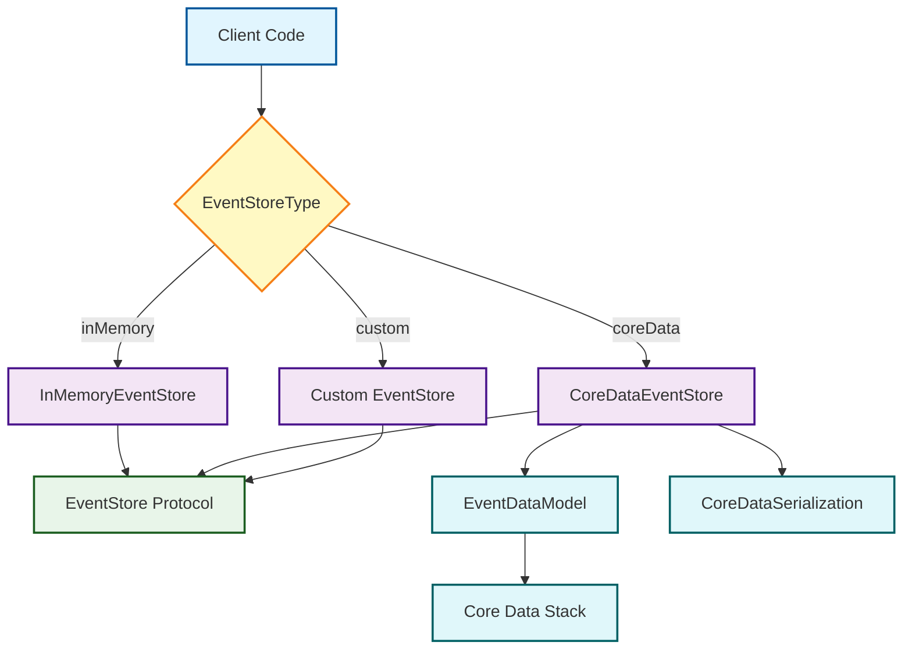
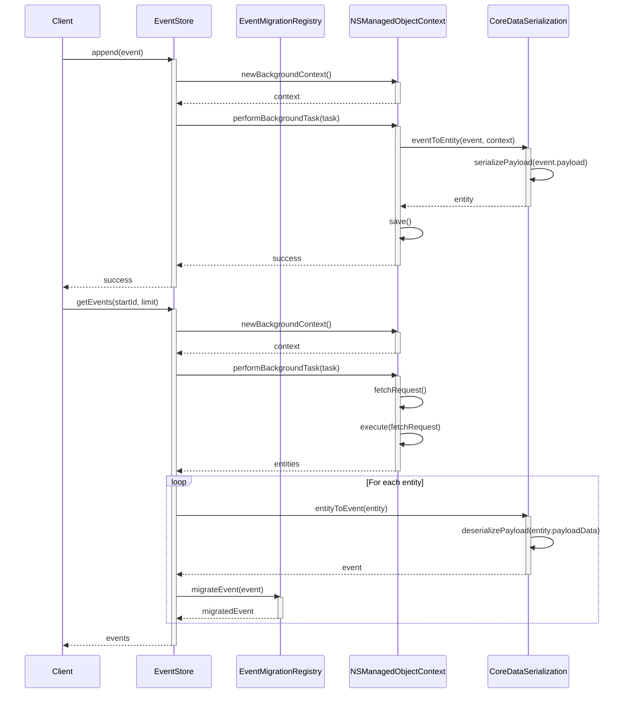

# Event Storage Architecture

This diagram illustrates the event storage architecture of the MonoSphere application, showing how events are stored and retrieved, and the relationship between different storage implementations.

## Event Store Protocol Hierarchy

## Core Data Storage Components

## Storage Implementation Factory

## Event Storage and Retrieval Sequence

## Storage Implementation Considerations

In the MonoSphere application, event storage follows these key design principles:

1. **Abstraction** - The EventStore protocol abstracts away storage implementation details
2. **Pluggability** - Multiple storage implementations can be swapped based on needs
3. **Migration Support** - All storage implementations support event migration
4. **Serialization** - Complex event payloads are serialized to binary data for storage
5. **Asynchronous Operations** - Storage operations are performed asynchronously
6. **Background Processing** - Core Data operations run in background contexts
7. **Transactional Safety** - Core Data provides transaction safety for event storage