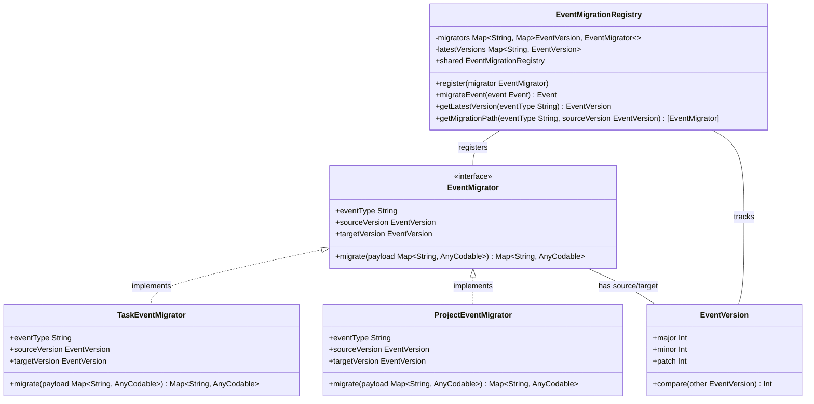
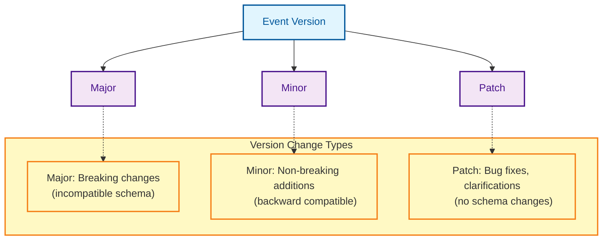
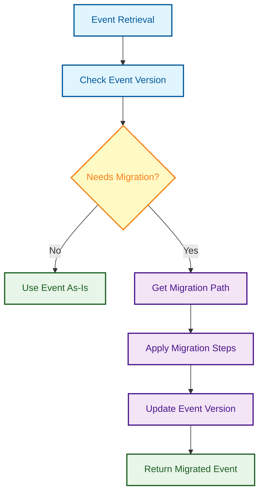
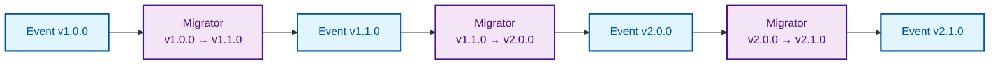
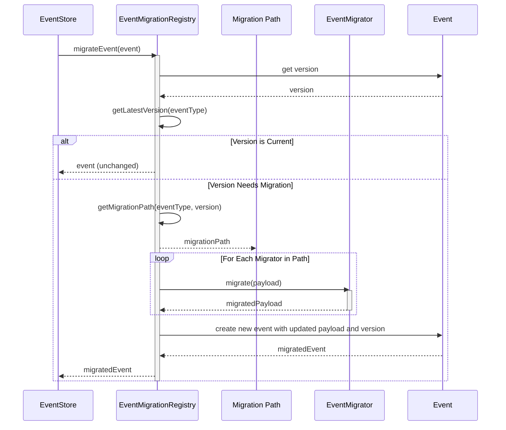
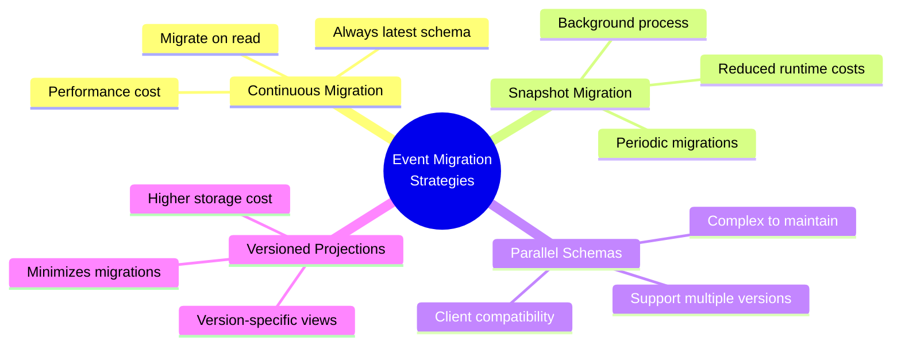

# Event Versioning and Migration

This document illustrates the event versioning and migration system in the MonoSphere application, which allows for schema evolution over time while maintaining backward compatibility.

## Event Migration Registry Architecture



## Event Versioning Structure



## Migration Path Discovery



## Migration Chain Example



## Migration Sequence



## Example Migration Implementation

```mermaid
classDiagram
    class TaskCreatedEventMigratorV1ToV2 {
        +eventType String = "task.created"
        +sourceVersion EventVersion = "1.0.0"
        +targetVersion EventVersion = "2.0.0"
        +migrate(payload Map~String, AnyCodable~) Map~String, AnyCodable~
    }
    
    class TaskEventMigrationExample {
        <<example>>
        V1.0.0 Payload:
        {
          "id": "task-123",
          "title": "Example Task",
          "description": "Task description",
          "status": "pending"  // Renamed to "isCompleted" in v2
        }
        
        V2.0.0 Payload:
        {
          "id": "task-123",
          "title": "Example Task", 
          "description": "Task description",
          "isCompleted": false,  // Changed from "status"
          "priority": "medium"   // New field
        }
    }
    
    TaskCreatedEventMigratorV1ToV2 -- TaskEventMigrationExample : transforms
```

## Migration Strategy Considerations



## Benefits of Event Versioning in MonoSphere

1. **Schema Evolution** - Allows event schemas to evolve over time
2. **Backward Compatibility** - Older events can still be processed with newer code
3. **Forward Compatibility** - Newer events can be partially understood by older code
4. **Migration Path** - Clear path for migrating between versions
5. **Semantic Versioning** - Clear indication of compatibility changes
6. **Automatic Migration** - Events are automatically migrated when retrieved