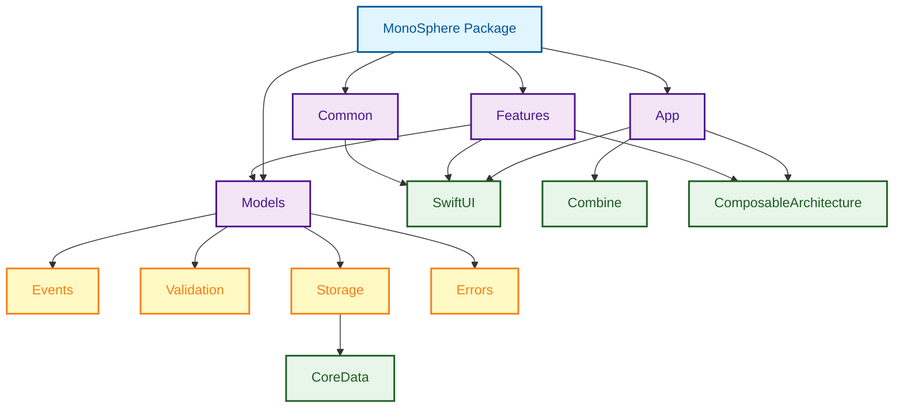
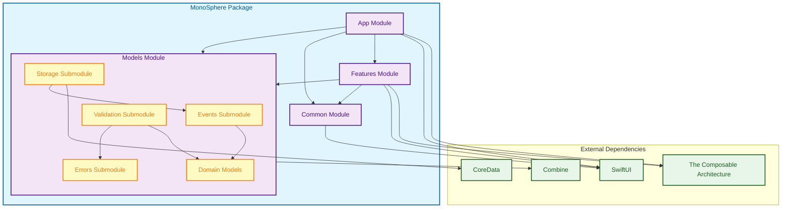
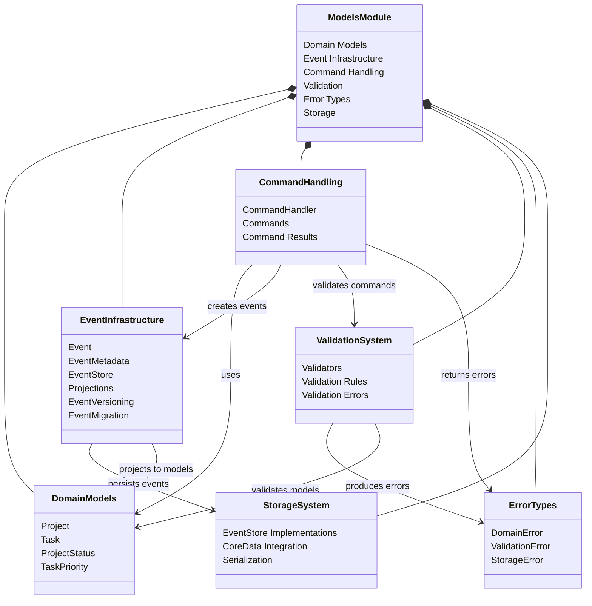
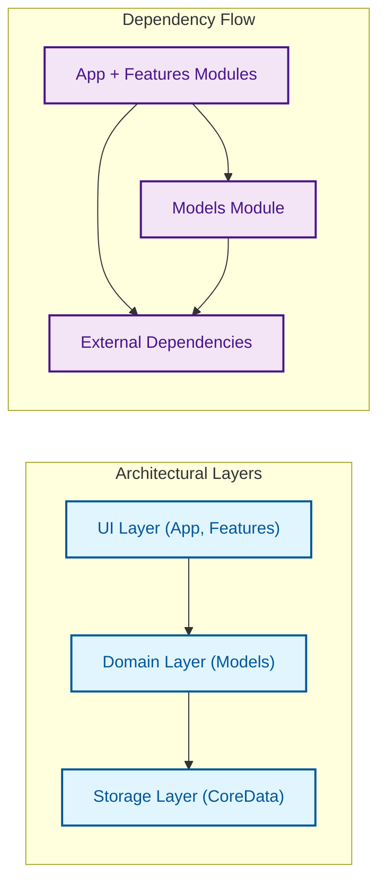

# Module Dependencies

This document illustrates the module dependencies in the MonoSphere application, showing how the different modules are organized and how they depend on each other.

## Swift Package Module Structure

## Module Dependencies Diagram

## Models Module Decomposition

## Features Module Composition

```mermaid
graph TD
    F[Features Module] --> P[Projects Feature]
    F --> T[Tasks Feature]
    F --> S[Settings Feature]
    F --> J[Journal Feature]
    
    P --> PL[Project List]
    P --> PD[Project Detail]
    P --> PC[Project Creation]
    P --> PE[Project Editing]
    
    T --> TL[Task List]
    T --> TD[Task Detail]
    T --> TC[Task Creation]
    T --> TE[Task Editing]
    
    subgraph TCA["TCA Components"]
        PR[Project Reducer]
        PS[Project State]
        PA[Project Actions]
        
        TR[Task Reducer]
        TS[Task State]
        TA[Task Actions]
    end
    
    P -.-> PR
    P -.-> PS
    P -.-> PA
    
    T -.-> TR
    T -.-> TS
    T -.-> TA
    
    classDef moduleNode fill:#e1f5fe,stroke:#01579b,stroke-width:2px,color:#01579b;
    classDef featureNode fill:#f3e5f5,stroke:#4a148c,stroke-width:2px,color:#4a148c;
    classDef viewNode fill:#fff9c4,stroke:#f57f17,stroke-width:2px,color:#f57f17;
    classDef tcaNode fill:#e8f5e9,stroke:#1b5e20,stroke-width:2px,color:#1b5e20;
    
    class F moduleNode;
    class P,T,S,J featureNode;
    class PL,PD,PC,PE,TL,TD,TC,TE viewNode;
    class PR,PS,PA,TR,TS,TA tcaNode;
```

## Common Module Components

```mermaid
graph TD
    C[Common Module] --> UI[UI Components]
    C --> U[Utilities]
    C --> S[Styles]
    
    UI --> B[Button Styles]
    UI --> CB[Card Components]
    UI --> L[List Components]
    UI --> T[Text Field Styles]
    UI --> N[Navigation Components]
    UI --> E[Empty States]
    UI --> LD[Loading Indicators]
    
    U --> F[Formatters]
    U --> V[Validators]
    U --> A[Animations]
    
    S --> C1[Color Schemes]
    S --> T1[Typography]
    S --> L1[Layout Constants]
    S --> Sh[Shadows and Elevations]
    
    classDef moduleNode fill:#e1f5fe,stroke:#01579b,stroke-width:2px,color:#01579b;
    classDef categoryNode fill:#f3e5f5,stroke:#4a148c,stroke-width:2px,color:#4a148c;
    classDef componentNode fill:#fff9c4,stroke:#f57f17,stroke-width:2px,color:#f57f17;
    
    class C moduleNode;
    class UI,U,S categoryNode;
    class B,CB,L,T,N,E,LD,F,V,A,C1,T1,L1,Sh componentNode;
```

## Dependency Flow Between Modules

## Key Module Responsibilities

| Module | Responsibility | Dependencies |
|--------|----------------|--------------|
| App | Application bootstrap, view composition | SwiftUI, TCA, Models, Features, Common |
| Models | Domain models, event sourcing, command handling | Combine, CoreData |
| Features | Feature-specific views and logic | SwiftUI, TCA, Models, Common |
| Common | Reusable UI components and utilities | SwiftUI |

The module organization follows clean architecture principles with:

1. **Separation of Concerns** - Each module has a clear, focused responsibility
2. **Dependency Direction** - Dependencies flow inward, with domain models at the core
3. **Testability** - Modules can be tested in isolation with mocked dependencies
4. **Reusability** - Common components are extracted to the Common module
5. **Encapsulation** - Implementation details are hidden behind clear interfaces