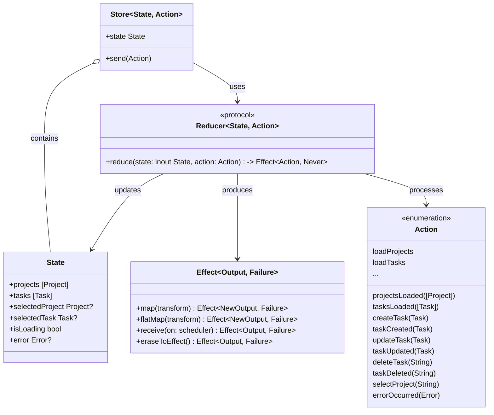
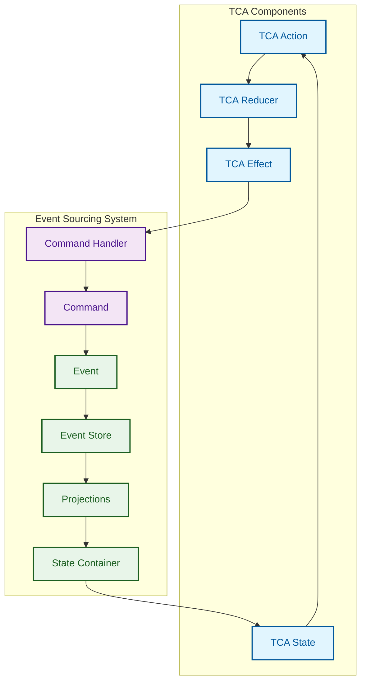
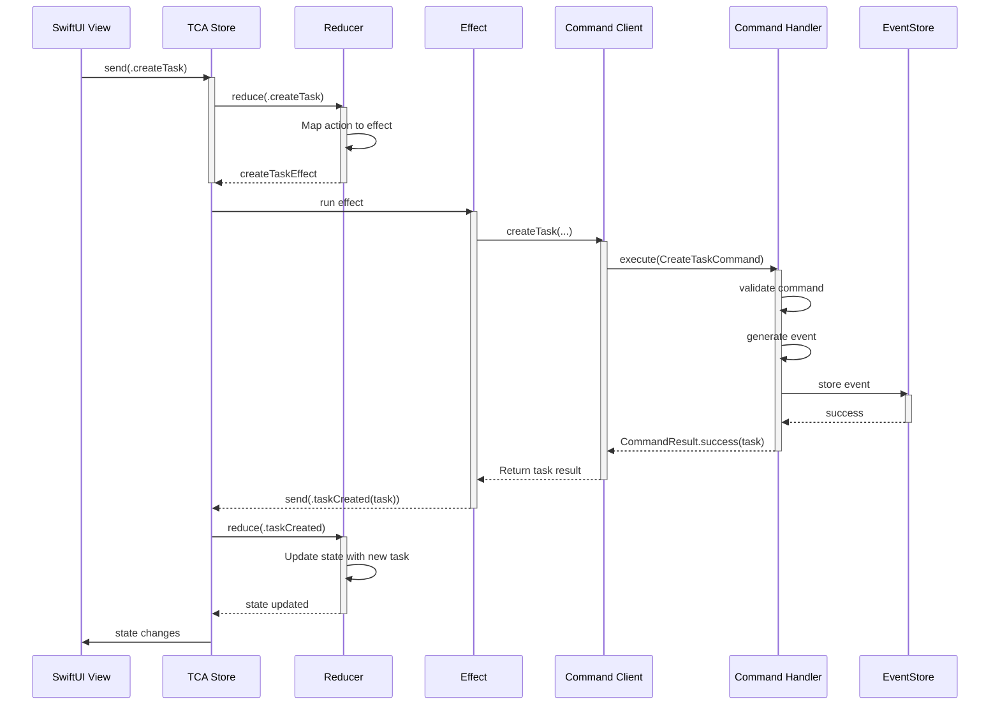
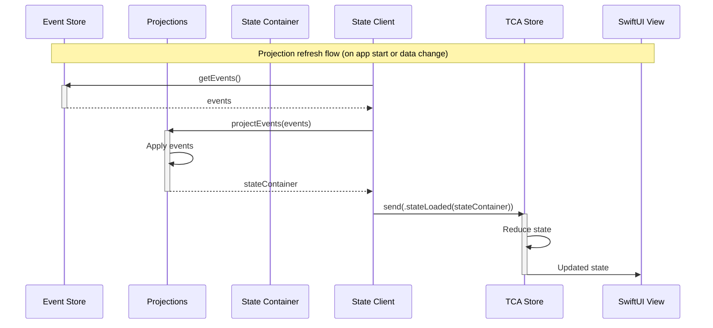
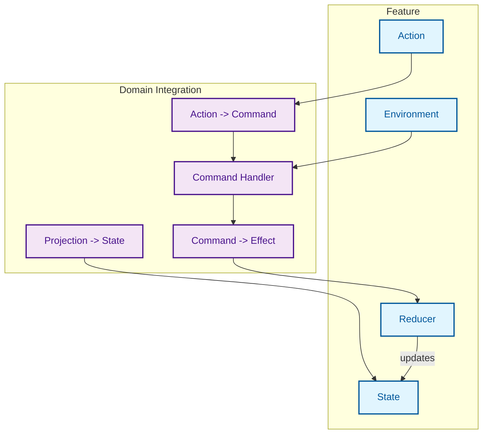
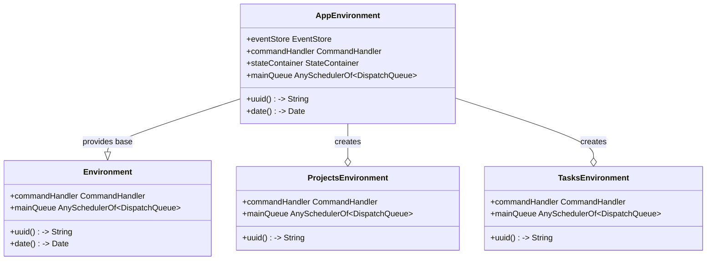
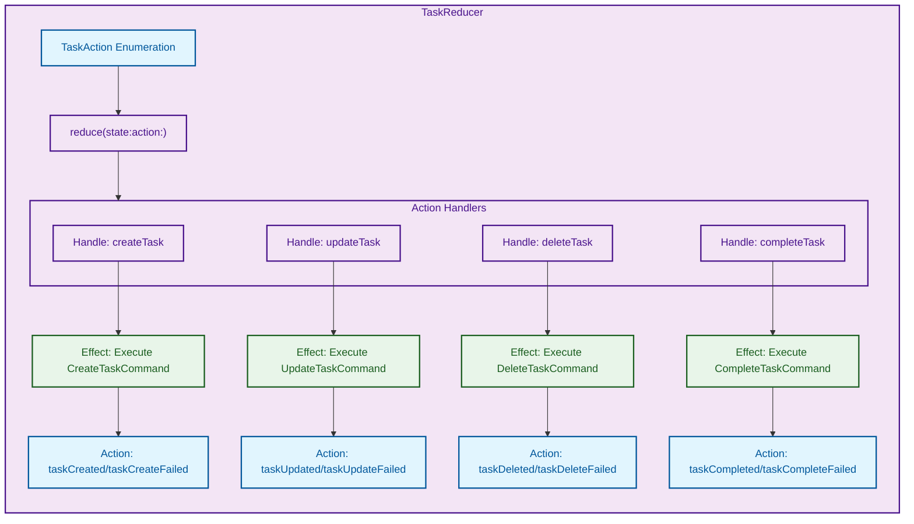

# TCA Integration

This document illustrates how The Composable Architecture (TCA) integrates with the event sourcing system in the MonoSphere application.

## TCA Component Structure

## TCA and Event Sourcing Integration

## TCA Action to Command Flow

## Projection to TCA State Flow

## TCA Component Structure

## TCA Environment Integration

## Example TCA Reducer

## TCA-Event Sourcing Benefits

The integration of TCA with event sourcing in MonoSphere offers several benefits:

1. **Predictable State Updates** - TCA reducers ensure consistent state transitions
2. **Isolated Side Effects** - Side effects are isolated in TCA effects
3. **Composable Features** - TCA enables feature composition and modularity
4. **Testable Actions** - Each action and effect can be tested in isolation
5. **Unidirectional Data Flow** - Clear data flow from user actions to state updates
6. **Single Source of Truth** - Event store is the single source of truth for application state

The integration pattern ensures that:

- TCA Actions map to Commands in the event sourcing system
- Command results trigger TCA Actions that update the UI state
- Event store projections feed into TCA State
- TCA Environment provides access to the CommandHandler and EventStore